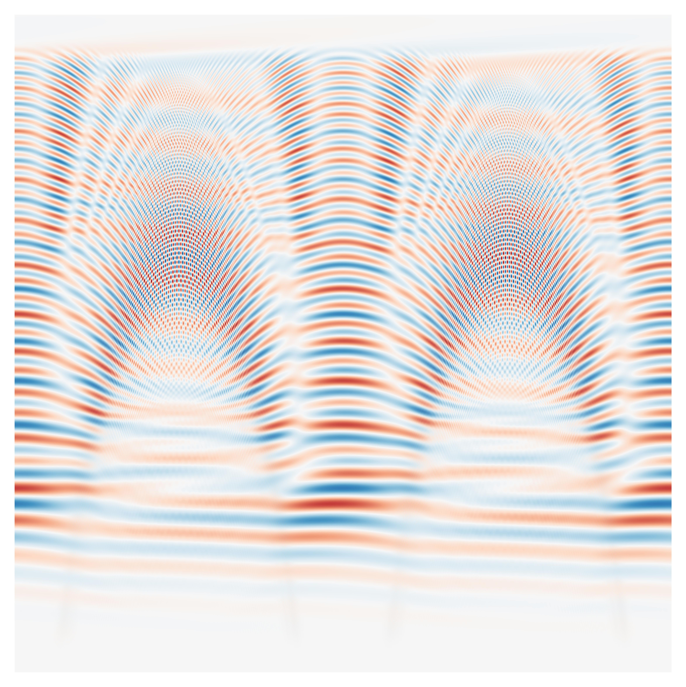

# Code for 'Conversion and Damping of Non-axisymmetric Internal Gravity Waves in Magnetized Stellar Cores'
**Cy S. David, Daniel Lecoanet, and Pascale Garaud**

## Overview
The code in this repository supports the main results in our paper on conversion and damping of non-axisymmetric internal gravity waves in magnetized stellar cores [1] (preprint available at [arXiv:2510.14026](https://arxiv.org/abs/2510.14026)). The folder `IVP/` contains Python scripts used to numerically solve the initial value problems (IVPs) in [1] using the [Dedalus](https://dedalus-project.org) pseudo-spectral framework [2]. The folder `EVP/` contains Python scripts used to construct the Wentzel-Kramers-Brillouin (WKB) solution in [1] and compare it to the simulation results. Finally, the Mathematica notebook "phase-mixing-toy.nb" generates the phase mixing figure and animation (Figure 3) in our manuscript.

## Steps to reproduce the figures and animations in [1]:
### Run simulations and plot
1\. Run IVP I ("sim28"), IVP II ("sim32"), and IVP III ("sim27"): 
From `IVP/`, run 

    python IVP_I.py
    python IVP_II.py
    python IVP_III.py

The scripts may be run with parallelization as, e.g.,

    mpirun -np 96 python IVP_I.py
    mpirun -np 192 python IVP_II.py
    mpirun -np 96 python IVP_III.py

2\. Generate frames for the animated versions of Figure 2 and Figure 4: 
From `IVP/`, run 

    python plot_sincos.py sim28
    python plot_sincos.py sim32

3\. Export snapshots from the last timestep and one-dimensional (1D) timeseries data: 
From `IVP/`, run 

    python export.py sim28
    python export_timeseries.py sim28
    python export.py sim32
    python export_timeseries.py sim32
    python export.py sim27
    python export_timeseries.py sim27
    
4\. Generate the static versions of Figure 2 and Figure 4 using `IVP/plot_ivp.ipynb` 

### Solve phase mixing toy problem
5\. Generate the animated and static versions of Figure 3 using the Mathematica notebook `phase-mixing-toy.nb`. 

### Solve eigenvalue problems and construct WKB solution
6\. Find WKB wavenumbers and eigenfunctions for both the axisymmetric and non-axisymmetric problems: 
From `EVP/`, run 

    python run_eigen_solves.py

7\. Construct the WKB solution and it compare to IVP III. Generate Figures 5, 6, 7, 8 using `EVP/construct_wkb.ipynb`. 
 
8\. Generate frames for the supplementary animation ("supplementary.mp4") available on the Zenodo repository: 
From `IVP/`, run 

    python plot_cg.py sim27

## Available data
The main static figures may be generated with Steps 4-7 without completing Steps 1-3, using the snapshots and 1D timeseries available on our [Zenodo repository](https://doi.org/10.5281/zenodo.18357092) at [doi:10.5281/zenodo.18357092](https://doi.org/10.5281/zenodo.18357092) in the compressed folder `data.zip`. The unzipped folder `data` should be placed in the directory `IVP/`. To download the data using the command line, run the following from `IVP/`: 

    wget -L -O data.zip "https://zenodo.org/records/18357093/files/data.zip"
    unzip data.zip
    rm data.zip

Then, follow Steps 4-7.

## References
[1]: C.S. David, D. Lecoanet, and P. Garaud. Conversion and Damping of Non-axisymmetric Internal Gravity Waves in Magnetized Stellar Cores. In review. (Preprint available at [arXiv:2510.14026](https://arxiv.org/abs/2510.14026)) 
[2]: Burns, K. J., Vasil, G. M., Oishi, J. S., Lecoanet, D., and Brown, B. P. 2020. Dedalus: A flexible framework for numerical simulations with spectral methods. Physical Review Research, 2, 023068
